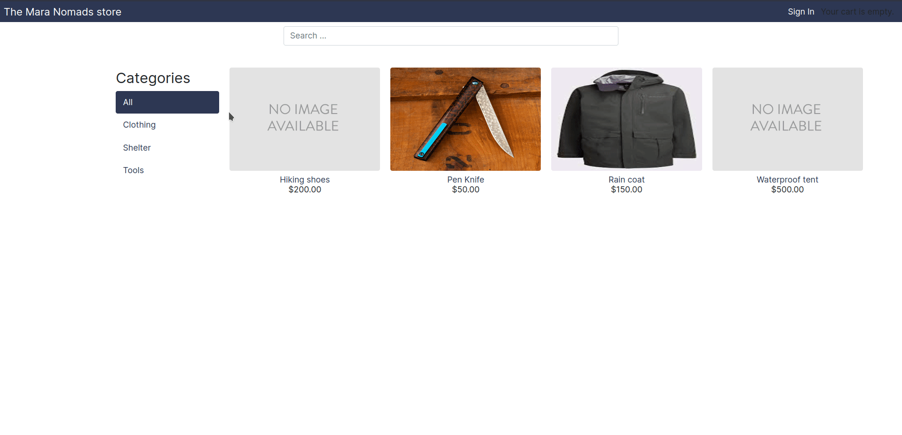

# [The Traveller's Store](https://marvinkweyu.net)

The Traveller's Shopping experience



- [The Traveller's Store](#the-travellers-store)
  - [Core features](#core-features)
  - [Setup](#setup)
    - [Bare metal](#bare-metal)
      - [Base requirements](#base-requirements)
      - [Running message brokers;](#running-message-brokers)
    - [Docker](#docker)


An article around the build process can be found on [marvinkweyu/themarastore](https://marvinkweyu.net/projects)
## Core features
:heavy_check_mark: Viewing items in the shop

:heavy_check_mark: Filtering items by category

:heavy_check_mark: Managing your cart

:heavy_check_mark: Email notifcations on order

:heavy_check_mark: Credit card payment

:heavy_check_mark: Generate PDF invoice on sale and send the invoice to the customer

:heavy_check_mark: Recommendation engine for products that go well with others


## Setup
---

### Bare metal
#### Base requirements

Install the following dependencies **before** running the `develop` bash script.

- Postgresql
- RabbitMQ
- Redis
- Weasyprint

Setup a virtual environment, install requirements , run migrations and run the server

```bash
bash develop.sh
```

#### Running message brokers;
Launch rabbitMQ on terminal 1
```bash
sudo rabbitmq-server
```
On a different terminal, launch celery

```bash
celery -A maranomadstore worker -l info
```

To monitor asynchronous tasks i.e task statistics
```bash
celery -A maranomadstore flower
```
Then access the task list queue on *localhost:5555*

Access the project via: **127.0.0.1:8000**

---
### Docker

**Development**

With *docker* and *docker-compose* installed , clone the repo and run the following command at the root of the project.
```bash
docker-compose -f local.yaml up -d --build
```

Access the project via: **127.0.0.1:8000**
